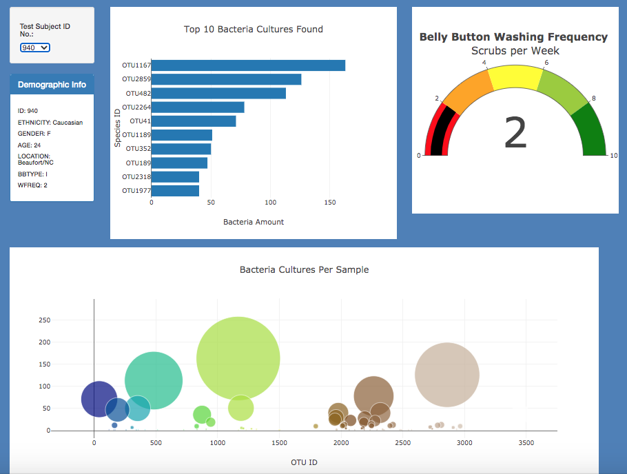

# Plotly and Belly Button Biodiversity

## Overview of the Project

The purpose of this project was to create interactive data visualizations in JavaScript using Plotly.js, a JavaScript visualization library (along with HTML, JS6, D3, and Bootstrap CSS), in order to aid a food company called "Improbable Beef" in analyzing bacteria found in study volunteers' navels.  The goal of the food startup was to compare these bacteria in order to determine if any of these bacteria may be useful in synthesizing proteins which taste like beef.  Given a JSON array of all the data collected from the study, including the ID numbers of the volunteers, an interactive and dynamic webpage was created which allows the participants and researchers alike to select a volunteer's ID in a dropdown menu in order to view the volunteer's demographics and the corresponding bacteria discovered on the selected participant.

---------------------------------------------
## Resources:

Data Sources: 

    samples.json

Software: 

    Chrome DevTools 86.0.4240.198, Visual Studio Code 1.49.2,
    Bootstrap 3.3.7, HTML5, ES6, D3, Plotly 4.13.0

---------------------------------------------

## Results

As a result of the interactive webpage, it is clear that Plotly served well to offer a variety of interactive visualization for aiding the food startup with pertinent details on each volunteer's bacterial results.  As seen in the following image, a screenshot of the website demonstrates how a particular volunteer's ID allows us to visualize a myriad of information at a glance.  In the top left corner, the dropdown menu defaults to the first volunteer with ID number 940.  Accordingly, the demographic panel and all three charts display the information from that candidate and the bacteria found in their navel.  The horizontal bar chart and the bubble chart are hoverable, allowing an interactive display of the OTU (species name(s)) and frequency found for those bacteria.  With a simple tweak in the dropdown menu selection, we can easily view the same information on any of the other individual participants.

Click here to visit the deployed interactive site and explore the results for various volunteer ID numbers:

https://alexconerly.github.io/plotlydeploy/

## Summary

From this analysis, it is clear that by incorporating plotly with html, csss, and JavaScript, one can very easily create a flexible, dynamic collection of visualizations which are highly customizable and intuitive in use.  The Plotly library is expansive in its capabilities and by using these tools the startup food company "Improbable Beef" is now able to easily visualize the data collected for further analysis.  Additionally, if any of these bacteria bide well in synthesizing the right proteins for the food company's business model, the volunteers can easily reference this dynamic site to deterimine if such a bacteria was part of their individual biosphere.  If so, the volunteer could offer to sell their bacteria to the startup company.  More broadly, however, this code can be easily refactored to accomodate a myriad of other visualization needs beyond Improbable Beef and this analysis offers a strong foundation to the vast window of possiblities available in Plotly using JavaScript.